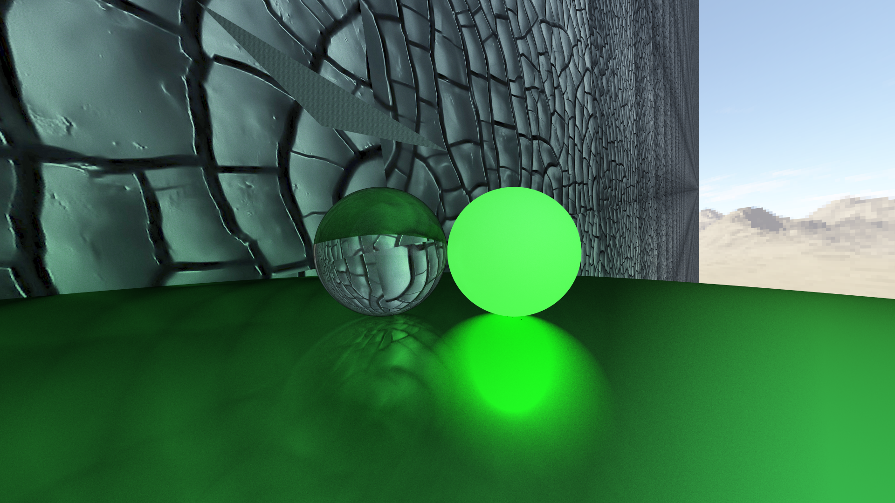
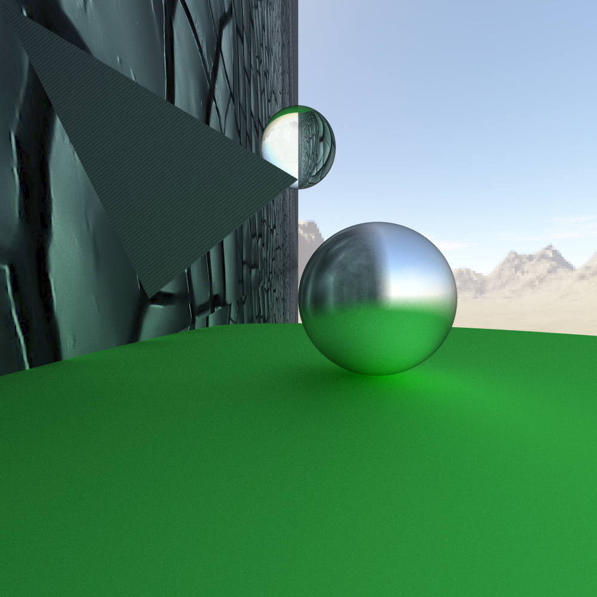

# Simple RayTracing Engine in Java

## Features
- Allows to render 3 primitive shapes:
  - triangle
  - sphere
  - plane

- skybox
- textures
- metalic, glowing and transprent materials
- loading scenes from json file

  
  

